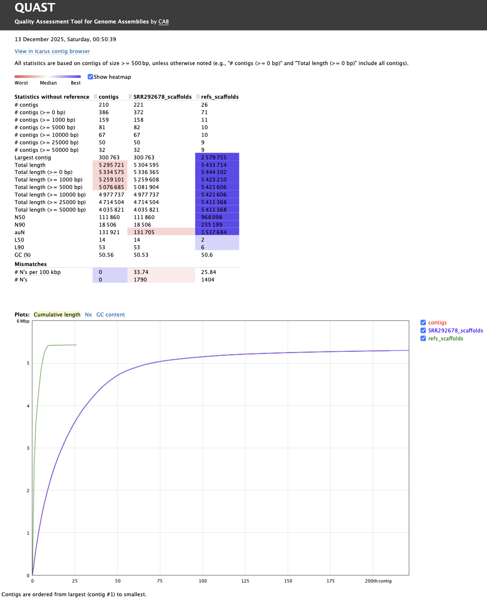
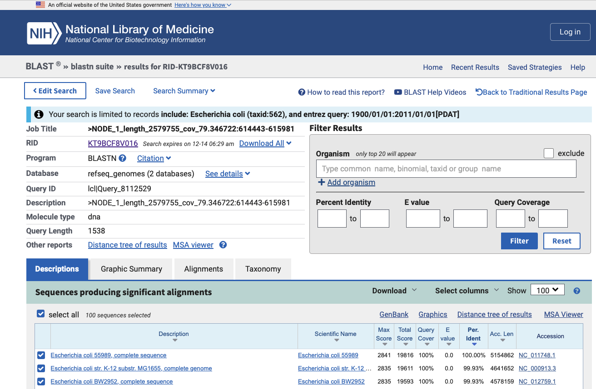
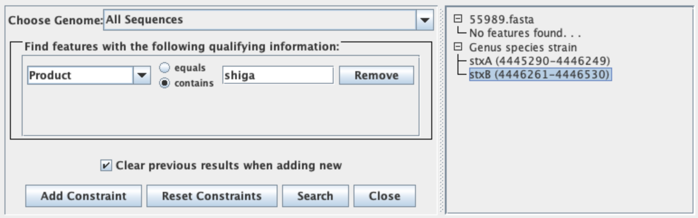
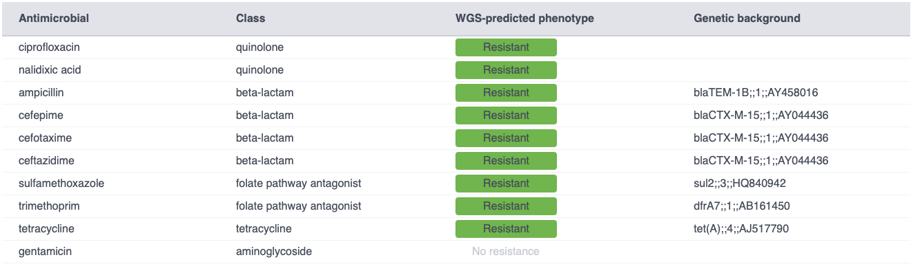
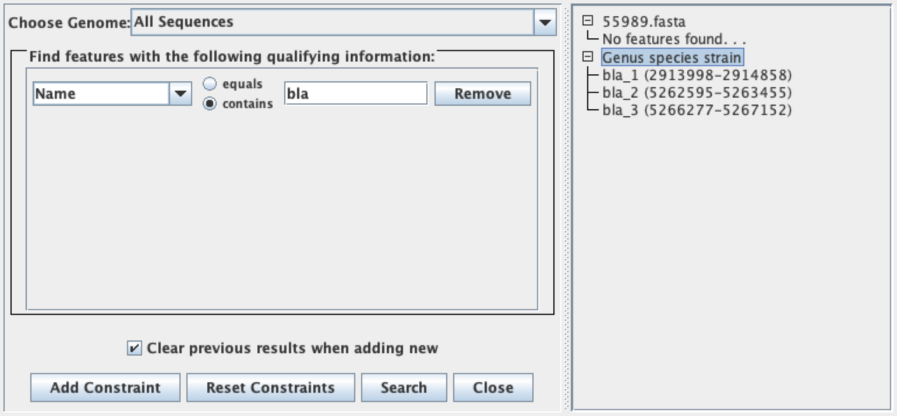

# 1
```bash
fastqc -o ./reads/fastqc reads/SRR292678sub_S1_L001_R1_001.fastq.gz reads/SRR292678sub_S1_L001_R2_001.fastq.gz
```

Reads count:  
> SRR292678sub_S1_L001_R1_001.fastq.gz - 5499346  
> SRR292678sub_S1_L001_R2_001.fastq.gz - 5499346

# 2 (OPTIONAL)

# 3 
The assembled genome was downloaded into the **refs** folder and extracted manually using the following command:  
```bash
unzip SRR292678.zip
```  

```bash
quast.py refs/SRR292678/contigs.fasta refs/SRR292678/scaffolds.fasta -t 1 -o quast/short_reads > quast/short_reads/quast.stdout.log 2> quast/short_reads/quast.stderr.log 
```  

# 4 
Long reads were downloaded to the **refs** folder:  

```bash
quast.py refs/SRR292678/contigs.fasta refs/SRR292678/scaffolds.fasta refs/scaffolds.fasta -t 1 -o quast/long_reads > quast/long_reads/quast.stdout.log 2> quast/long_reads/quast.stderr.log   
```  

QUAST report:  
  
> *contigs: short conting*  
> *SRR292678_scaffolds: short scaffolds*  
> *refs_scaffolds: long scaffolds*  

Task: Also answer, how did the quality of the assembly improved and why.  
Answer:  
> The assembly showed a clear improvement: the number of contigs dropped sharply (Contigs: 210/221 → 26) while their length increased significantly (Largest contig: 300,763 → 2,579,755 / N50: 111,860 → 968,098).  
> This result is achieved because long reads can span repetitive sequences and reduce the complexity of the assembly graph.  


# 5
```bash
prokka --outdir prokka --force --centre XXX refs/scaffolds.fasta
```

# 6 
```bash
barrnap refs/scaffolds.fasta --kingdom bac --threads 6 > barrnap/barrnap_my_bac.gff 2> barrnap/barrnap_my_bac.stderr.log  
awk 'NR==1 || $9 ~ /^Name=16S_rRNA/' barrnap/barrnap_my_bac.gff > barrnap/barrnap_my_bac.16s_rrna.gff
awk '!/^#/ {print $1 "\t" $4-1 "\t" $5 "\t" $9}' barrnap/barrnap_my_bac.16s_rrna.gff > barrnap/barrnap_my_bac.16s_rrna.bed
bedtools getfasta -fi refs/scaffolds.fasta -bed barrnap/barrnap_my_bac.16s_rrna.bed > barrnap/barrnap_my_bac.16s_rrna.fa
```

We found eight regions that match 16S rRNA.  
One of these regions aligned to only 25% of the full 16S rRNA sequence.  
Four regions are on the forward strand, and four are on the reverse strand.  
All eight regions have different positions on the chromosome. They are most likely unique sequences (transcribed in opposite directions) and not just reverse-complement copies of each other.  

BLAST results:  
  
> *Name (DEFINITION): **Escherichia coli 55989, complete sequence.***  
> *Annotation Name: **GCF_000026245.1-RS_2025_06_09***  
> *ACCESSION: **NC_011748***  

# 7 
Mauve was downloaded from the [source](https://darlinglab.org/mauve/download.html).  
  
In the E. coli X strain we studied, we found two genes that code for Shiga toxins. To be precise, these are two subunits.   
1. stxA (4445290-4446249)  
2. stxB (4446261-4446530)

# 8 
Yes, my file has many "hypothetical proteins". However, the nearby nohA_3 gene is a clue. This gene codes for a prophage DNA-packing protein. This suggests that the stxA and stxB genes were likely acquired by horizontal transfer. Specifically, this probably happened through lysogeny, which is when a phage genome integrates into the bacterial chromosome.  
> nohA_3 (Prophage DNA-packing protein NohA) (4448169-4448717)

# 9 
**E. coli X AR:**  
  

**55989 AR:**  
  

# 10
  
The likely mechanism involves mobile genetic elements — specifically, plasmids that carry transposons.  
> tnpR_1 (Transposon Tn3 resolvase) (2915041-2915292)  
> tnpR_2 (Transposon Tn3 resolvase) (5263638-5264195)  
